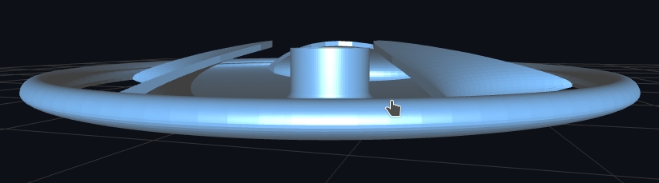
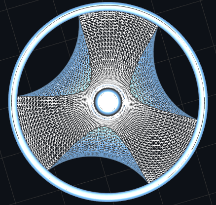
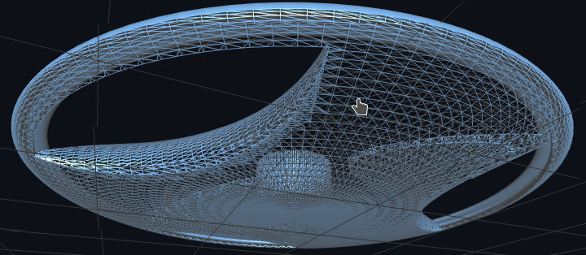

# Sabu Disc

<br/>

## Preview








<br/>

## Module API

```scad
module sabu_disc(
    fins,
    fin_h,
    fin_d,
    fin_t,
    hole_r,
    hole_arc_deg,
    hole_margin,
    plate_r,
    plate_c,
    plate_t,
    pole_r,
    pole_t,
    pole_h,
    pole_fi,
    pole_fo,
    rim_edge,
    rim_open_deg
)
```

### Nomenclature

`<Will be added soon>`

<br/>

## License

This repository is released under [MIT License](LICENSE).